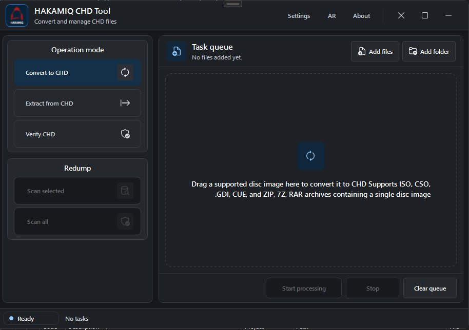

# Hakamiq CHD Tool

**A Windows x64 desktop application for converting, extracting, and verifying CHD-based disc image workflows without writing `chdman` commands by hand.**

If Hakamiq CHD Tool is useful to you, consider giving the repository a ⭐. It helps other retro gaming and emulation users discover the project.

## Highlights

- Convert supported disc-image workflows to CHD.
- Support for ISO, CUE/BIN, GDI/TOC, CSO, and supported ZIP/RAR/7Z archive workflows.
- Verify existing CHD files.
- Extract supported CHD types to CUE/BIN, ISO, or IMG depending on media type.
- Validate paths, descriptor references, archives, and output conditions before processing.
- Batch processing through a desktop task queue.
- Optional Redump-based verification using user-provided data.
- Native Windows desktop interface built with WPF.

## Download

### Latest release

https://github.com/HAKAMIQ/HakamiqChdTool.App/releases/latest

For the runtime-required Windows x64 package:

`HakamiqChdTool-vX.Y.Z-win-x64-runtime-required.zip`

Requires **.NET 10 Desktop Runtime x64**.

## Quick start

1. Download the latest Windows x64 release.
2. Extract the ZIP to a normal folder.
3. Run `HakamiqChdTool.exe`.
4. Add a supported file or folder.
5. Choose the output location.
6. Start processing.

For your first test, use a single disc image before processing a larger batch.

## Supported workflows

| Input | Current workflow |
|---|---|
| ISO | CHD creation where supported |
| CUE/BIN | Descriptor-aware CHD creation |
| GDI / TOC | Descriptor-aware processing |
| CSO | Prepared before normal CHD conversion |
| CHD | Verification and supported extraction |
| ZIP / RAR / 7Z | Candidate extraction and validation before processing |
| BIN / RAW | Requires enough evidence for a safe workflow |
| NRG | Accepted only where the current workflow supports it |
| CDI | Not supported in the current workflow |

Detecting an input format does not automatically mean every operation is valid. Hakamiq CHD Tool validates the selected workflow before external processing begins.

See [Supported formats](docs/FORMATS.md) for detailed behavior.

## Safety

Hakamiq CHD Tool performs checks before conversion starts, including:

- input readability
- output-path validation
- descriptor reference validation
- unsafe CUE path detection
- archive validation
- supported-layout checks

Broken, incomplete, unsupported, or unsafe input should stop before conversion instead of producing misleading output.

## CHD extraction

Supported extraction depends on the CHD media type:

- CD and GD-ROM CHD normally extract to CUE/BIN.
- DVD CHD normally extracts to ISO.
- Hard disk CHD normally extracts to IMG.

## Documentation

- [User guide](docs/USER_GUIDE.md)
- [Supported formats](docs/FORMATS.md)
- [Conversion options](docs/CONV_OPTS.md)
- [chdman integration](docs/CHDMAN.md)
- [Errors and troubleshooting](docs/ERRORS.md)
- [Architecture](docs/ARCHITECTURE.md)
- [PS3 experimental support](docs/PS3_EXP.md)

## Limitations

- Windows x64 only.
- The bundled MAME 0.289 tool requires an x86-64-v2 capable processor.
- Not every disc layout is supported.
- CHD operations still depend on `chdman` capabilities.
- PS3-related support is experimental and mostly detection-oriented.

## Security and reproducibility

Dependency versions are locked, bundled tool hashes are pinned, and release output includes a CycloneDX 1.7 SBOM.

See [SECURITY.md](SECURITY.md) for vulnerability reporting.

## Legal

Hakamiq CHD Tool does not include games, ROMs, BIOS files, Redump databases, DAT files, or disc images.

Use the application only with files you own or are legally authorized to process.

## Contributing

Contributions are welcome.

See [CONTRIBUTING.md](CONTRIBUTING.md) before submitting changes.

## License

Licensed under the [MIT License](LICENSE).